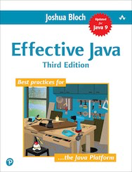

# CSCI Computer Science II

### Spring 2018

---

## Textbooks

---

 

[Algorithms (Fourth Edition)](http://algs4.cs.princeton.edu/home/) by [Robert Sedgewick](http://www.cs.princeton.edu/~rs/) and [Kevin Wayne](http://www.cs.princeton.edu/~wayne/contact/). **(Required)**

Don't be fooled by the title, this excellent book is for CSCI 1102 notwithstanding the fact that its title matches CSCI 3383.  This is a relatively high-level and rigorous introductory text on data structures and algorithms. It emphasizes scientific applications. We will make heavy use of the accompanying software libraries. The libraries are freely distributed on the [book website](http://algs4.cs.princeton.edu/home/).

This book is available through [Amazon](http://www.amazon.com/Algorithms-4th-Robert-Sedgewick/dp/032157351X/ref=sr_1_1?ie=UTF8&qid=1322093778&sr=8-1) for about \$60 new, \$40 used and for rent at \$23. 

.

---

[Effective Java (Third Edition)](http://java.sun.com/docs/books/effective/), by [Joshua Bloch](http://research.google.com/pubs/author32.html). **(Required)**

Every serious Java programmer should have it on their bookshelf.  The author has an excellent understanding of Java and software engineering principles in general. The book dispenses great advice on writing good Java code.

Effective Java is available through [Amazon](https://www.amazon.com/Effective-Java-3rd-Joshua-Bloch/dp/0134685997) for about \$42.

